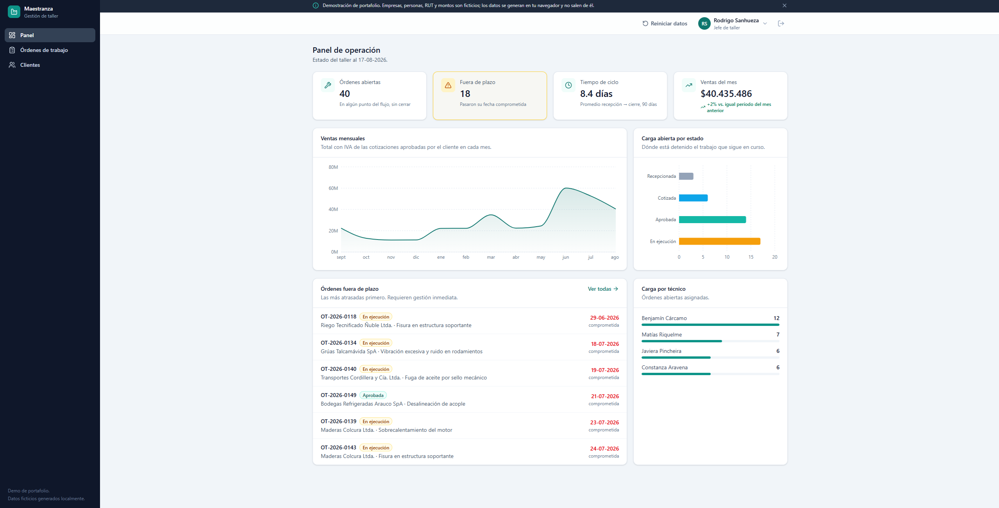
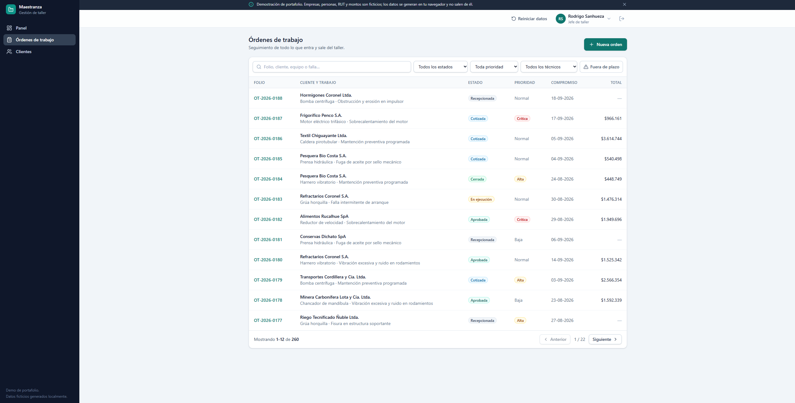
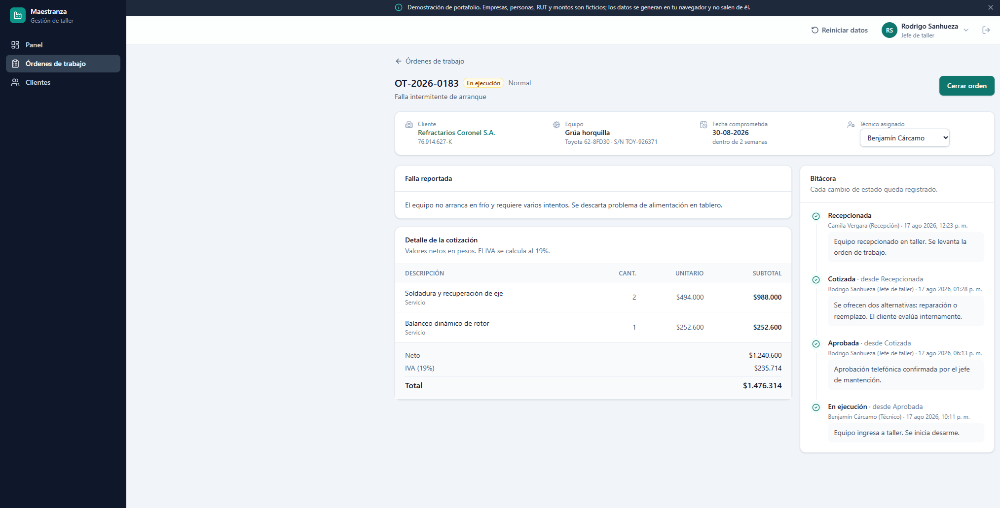

<div align="center">

# Maestranza

**Sistema de gestión de órdenes de trabajo para maestranzas y talleres industriales**

Desde que ingresa un equipo al taller hasta que la orden se cierra y se factura.


**[▶ Ver demo en vivo](https://maestranza-demo.netlify.app/)** · Entra como jefe de taller, recepción o técnico y compara



</div>

---

Construido como demo de portafolio, así que **no tiene servidor**: la API está simulada en el
navegador con datos ficticios. Aun así, el código de la aplicación es exactamente el que se
escribiría contra un backend real —mismas peticiones HTTP, mismos estados de carga, mismos
errores—, y migrar a uno consiste en borrar una carpeta.

---

## Qué muestra

| Capacidad | Dónde se ve |
|---|---|
| Flujo de estados auditado | Ficha de OT: transiciones válidas según estado y rol, con bitácora inmutable |
| Permisos por rol | Tres roles con distinta navegación, acciones y visibilidad de montos |
| Indicadores de operación | Panel con ventas, tiempo de ciclo, carga por técnico y órdenes fuera de plazo |
| Validación de negocio | RUT con dígito verificador, unicidad, coherencia cliente–equipo, IVA 19 % |
| Estado en la URL | Filtros y paginación compartibles; recargar mantiene la vista |

### Listado de órdenes

Filtros combinables sobre 260 órdenes, todos reflejados en la URL. Las fechas comprometidas
que ya vencieron se marcan en rojo, y la columna de totales solo existe para quien tiene
permiso de ver montos.



### Ficha de la orden

Las acciones del encabezado no son fijas: se calculan según el estado actual y el rol de quien
mira. La bitácora de la derecha registra cada transición con autor, rol, fecha y nota, y no se
puede editar —sin eso, la trazabilidad de un taller no vale nada.



## Cuentas de demostración

Contraseña para todas: `demo1234`

| Rol | Correo | Qué puede hacer |
|---|---|---|
| Jefe de taller | `jefe@maestranza.demo` | Todo: panel, montos, clientes, asignar técnicos, anular órdenes |
| Recepción | `recepcion@maestranza.demo` | Levanta y cotiza órdenes, gestiona clientes. No asigna técnicos ni anula |
| Técnico | `tecnico@maestranza.demo` | Solo su carga asignada. Sin panel, sin montos, sin clientes |

Desde la barra superior se puede **cambiar de rol sin volver a autenticar**, para comparar las
tres vistas rápido.

---

## Stack

- **React 19** + **TypeScript** (modo estricto, `noUncheckedIndexedAccess`, `erasableSyntaxOnly`)
- **Vite 8** y **Tailwind CSS 4**
- **TanStack Query** para estado de servidor; **Zustand** para sesión
- **React Hook Form** + **Zod** en formularios
- **MSW** como API simulada; **Recharts** para gráficos
- **Vitest** para pruebas

## Arquitectura

```
src/
├── domain/      Modelo, máquina de estados y matriz de permisos (sin dependencias de UI)
├── mocks/       API simulada: handlers, almacén y generador de datos semilla
├── api/         Cliente HTTP, contratos y hooks de TanStack Query
├── components/  Sistema de UI y chasis de la aplicación
├── features/    Piezas con lógica de negocio (modales de OT y de cliente)
└── pages/       Vistas enrutadas
```

`domain/` no importa nada de React ni de la API: son las reglas del negocio en TypeScript
puro, y por eso es lo que está cubierto por pruebas.

### Decisiones que vale la pena explicar

**La API está simulada con MSW, no con datos en memoria.**
MSW intercepta `fetch` a nivel de service worker, así que la aplicación hace peticiones HTTP
reales contra `/api/*`: mismos estados de carga, mismos códigos de error, mismo código de
cliente que contra un servidor de verdad. Migrar a un backend real es borrar `src/mocks/` y
apuntar la URL base a otro sitio; ni un componente cambia. El costo es peso: MSW y los datos
suman ~139 kB comprimidos en la carga inicial. Para un demo sin servidor, es el intercambio
correcto.

**Hay un respaldo si el service worker no registra.**
Navegación privada, webviews embebidos o políticas corporativas pueden bloquear el registro
de un service worker. Sin respaldo, esos visitantes verían una página en blanco. Cuando falla,
`src/mocks/fallback.ts` envuelve `fetch` y despacha **los mismos handlers** con la API pública
de MSW: no existe una segunda implementación del backend que pueda desincronizarse.

**La autorización se verifica en el servidor simulado, no ocultando botones.**
`TRANSICIONES` en `domain/workflow.ts` declara qué roles pueden ejecutar cada cambio de estado.
La misma tabla alimenta la interfaz (qué botones se muestran) y los handlers (qué transiciones
se aceptan), de modo que no puedan divergir. Forzar una transición no permitida devuelve 403.

**Los datos semilla son deterministas y coherentes.**
Un PRNG con semilla fija genera el mismo conjunto en cada carga y en cada navegador, pero las
fechas se calculan relativas a hoy para que el demo nunca se vea congelado. La coherencia está
cubierta por pruebas: cada falla debe ser físicamente posible en su equipo (un motor eléctrico
no pierde presión hidráulica), la bitácora no puede tener hitos futuros, los folios son
correlativos por año y toda transición registrada debe ser válida según la máquina de estados.

**La venta se reconoce al aprobar la cotización, no al cerrar la orden.**
Reconocerla al cierre hundía sistemáticamente el mes en curso: los trabajos recientes siguen
en ejecución y su ingreso aparecería meses después de haberse comprometido. La comparación
mes contra mes además se acota al mismo día de corte, porque contrastar un mes a medias contra
uno completo siempre arroja una caída falsa.

---

## Ejecutar en local

```bash
npm install
npm run dev
```

| Comando | Qué hace |
|---|---|
| `npm run dev` | Servidor de desarrollo en `http://localhost:5173` |
| `npm run build` | Verificación de tipos y compilación a `dist/` |
| `npm run preview` | Sirve el resultado de `build` |
| `npm test` | Pruebas con Vitest |
| `npm run typecheck` | Solo verificación de tipos |
| `npm run lint` | oxlint |

### Datos

Los datos viven en `localStorage`, así que los cambios sobreviven a un refresco. El botón
**Reiniciar datos** de la barra superior vuelve a la semilla original.

Para ver cómo responde la interfaz ante fallas del servidor, se puede activar el modo caos
desde la consola del navegador; hace fallar ~25 % de las mutaciones con un 503:

```js
localStorage.setItem('maestranza:caos', '1')
```

Está apagado por defecto: un demo que falla al azar juega en contra.

---

## Alcance

Esto es un MVP deliberado. Está completo y funcionando de punta a punta en lo que cubre:

- [x] Autenticación y permisos por rol
- [x] Órdenes de trabajo con máquina de estados y bitácora
- [x] Clientes y equipos con validación de RUT
- [x] Panel de indicadores
- [x] Filtros persistidos en la URL, estados vacíos, de carga y de error

Queda fuera a propósito, para iteraciones siguientes:

- [ ] Edición de la cotización desde la interfaz (hoy los ítems vienen de la semilla)
- [ ] Inventario de repuestos con descuento de stock
- [ ] Exportación a Excel y PDF
- [ ] Recorrido guiado para quien entra por primera vez
- [ ] Modo offline (PWA) para uso en taller

---

## Aviso

Todos los datos son ficticios y se generan en el navegador: empresas, personas, RUT, montos y
números de serie. Nada sale del equipo del visitante ni se envía a ningún servidor.
